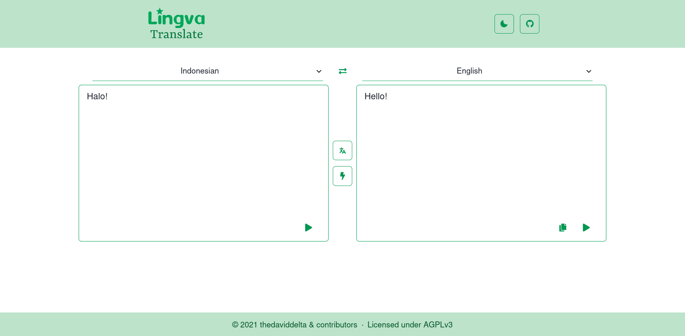

<!--
NB: Deze README is automatisch gegenereerd door <https://github.com/YunoHost/apps/tree/master/tools/readme_generator>
Hij mag NIET handmatig aangepast worden.
-->

# Lingva Translate voor Yunohost

[](https://ci-apps.yunohost.org/ci/apps/lingva/)


[](https://install-app.yunohost.org/?app=lingva)

*[Deze README in een andere taal lezen.](./ALL_README.md)*

> *Met dit pakket kun je Lingva Translate snel en eenvoudig op een YunoHost-server installeren.*  
> *Als je nog geen YunoHost hebt, lees dan [de installatiehandleiding](https://yunohost.org/install), om te zien hoe je 'm installeert.*

## Overzicht

Alternative front-end for Google Translate, serving as a Free and Open Source translator with over a hundred languages available.


**Geleverde versie:** 2023.1.13~ynh3

**Demo:** <https://lingva.ml>

## Schermafdrukken



## :red_circle: Anti-eigenschappen

- **Non-free Network Services**: Promotes or depends entirely on a non-free network service.

## Documentatie en bronnen

- Upstream app codedepot: <https://github.com/thedaviddelta/lingva-translate>
- YunoHost-store: <https://apps.yunohost.org/app/lingva>
- Meld een bug: <https://github.com/YunoHost-Apps/lingva_ynh/issues>

## Ontwikkelaarsinformatie

Stuur je pull request alsjeblieft naar de [`testing`-branch](https://github.com/YunoHost-Apps/lingva_ynh/tree/testing).

Om de `testing`-branch uit te proberen, ga als volgt te werk:

```bash
sudo yunohost app install https://github.com/YunoHost-Apps/lingva_ynh/tree/testing --debug
of
sudo yunohost app upgrade lingva -u https://github.com/YunoHost-Apps/lingva_ynh/tree/testing --debug
```

**Verdere informatie over app-packaging:** <https://yunohost.org/packaging_apps>
